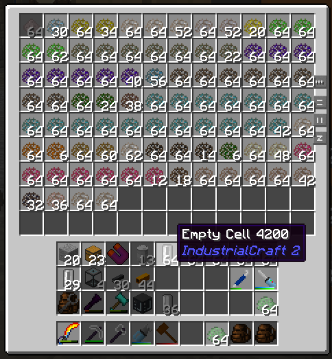
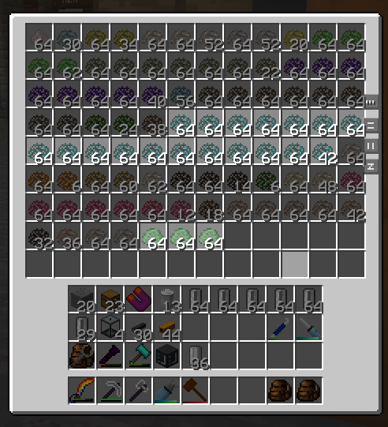

# Not Enough Elements

A Not Enough Items addon Mod, providing advanced searching on Elements of GregTech items.

You can activate it by starting with `el:` or `element:`, and connects with the elements in short, like `el:Og`(matching
items that contains Oganesson) or `element:Al !O`(matching items that contains Aluminium, and not contains Oxygen).

## Inspiration

I just want to find the ores with Chromium, and as I search for `Cr`, all the **Cr**ushed Ores pops up, and got me mad!

## What's wrong with GTNH?

OK, I found the problem on *Sodium Tungstate*, which is added by some magic with no Materials can be found in GregTech API.\
So it is expected to be filtered when searching for elements.\
This problem can only be fixed by the modpack authors.
